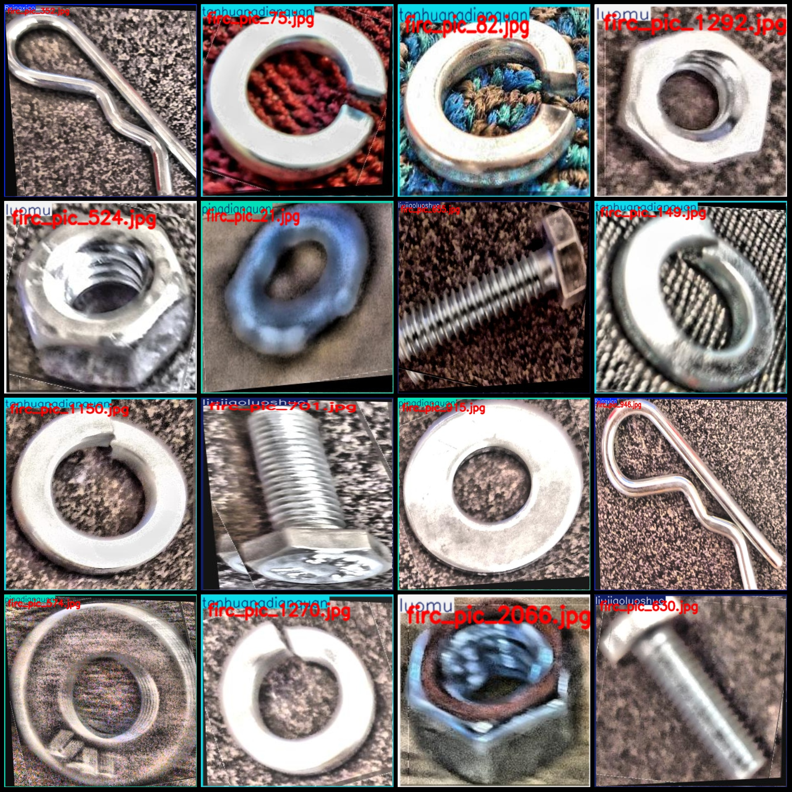
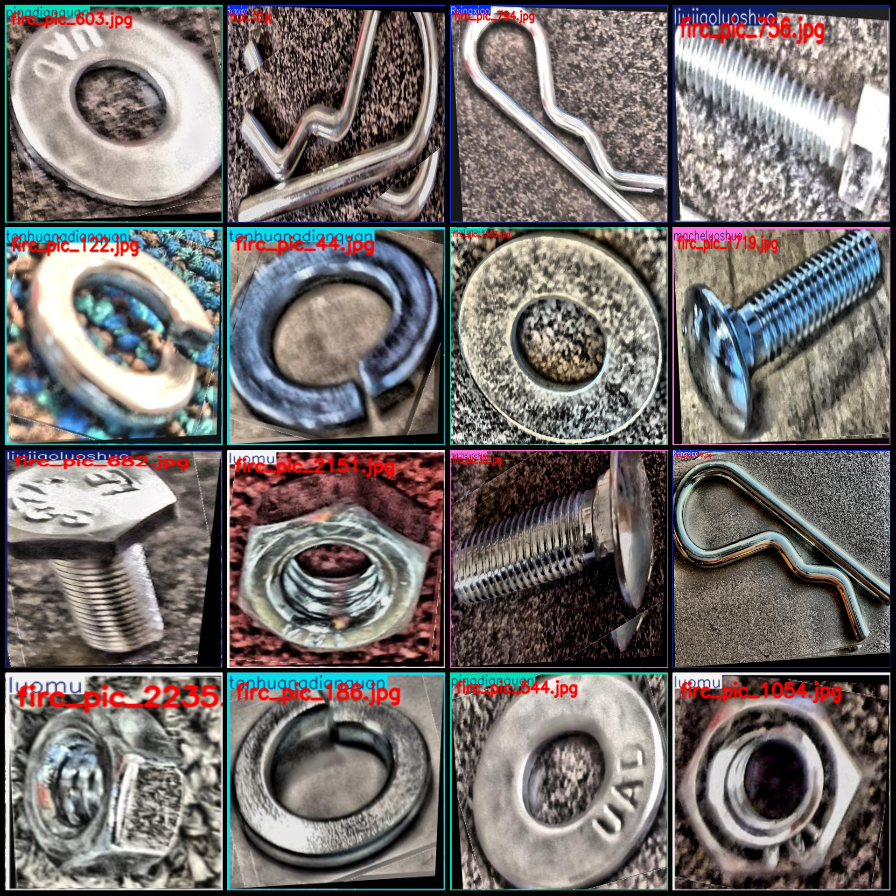

# Industrial Fasteners, Bolts, and Washers Detection Data Set - VOC + YOLO Format - 2357 Images in 6 Categories

Dataset format: Pascal VOC format + YOLO format (excluding segmentation paths, only including jpg images and corresponding VOC format xml files and yolo format txt files)
Number of images (jpg file count): 2357
Number of annotations (xml file count): 2357
Number of annotations (txt file count): 2357
Number of annotation categories: 6
Annotation category names (Note that the order of categories in the yolo format does not correspond to this, but is based on the labels folder's classes.txt): ["Rxingxiao", "liujiaoluoshuo", "luomu", "macheluoshuo", "pingdianquan", "tanhuangdianquan"]
Each category has a number of bounding boxes: ["R-shaped pin", "Hexagonal bolt", "Screw", "Pony bolt", "Flat washer", "Spring washer"]
Rxingxiao bounding box count = 430
liujiaoluoshuo bounding box count = 448
luomu bounding box count = 485
macheluoshuo bounding box count = 245
pingdianquan bounding box count = 308
tanhuangdianquan bounding box count = 441
Total bounding boxes: 2357
Number of images per category:
Rxingxiao occupies a picture count = 430
Liu Jiaoluo's claim of 448 images = 448
Luomu owns 485 images.
Macheluoshuo occupies a picture count = 245.
Pingdianquan's possession of image counts = 308
"Tanhuangdianquan" is a Chinese phrase that translates to "Tanhuang's Domain of Security." The number "441" in the context of this phrase does not have a direct English translation.
Image resolution: Multi-resolution images, such as 394x389, 484x671, etc.
LabelImg is a free online tool that helps you to label images. It provides an easy-to-use interface for adding annotations to your images. You can use it to tag objects, add text, and more.
Rules for annotation: draw a box around the category.
Important note: The dataset does not have splits for training, validation, and testing. Please make the necessary splits yourself.
Special Notice: This dataset does not guarantee the accuracy of trained models or weight files.
Preview of the image:
Example: Labeling an example
## Images

Here is a pay link on Stripe ( https://buy.stripe.com/3cs8yP7sY87d0vu9AB ). Please contact me lonlonago@foxmail.com after funding $89, and I will send you a complete data files , thank you!

